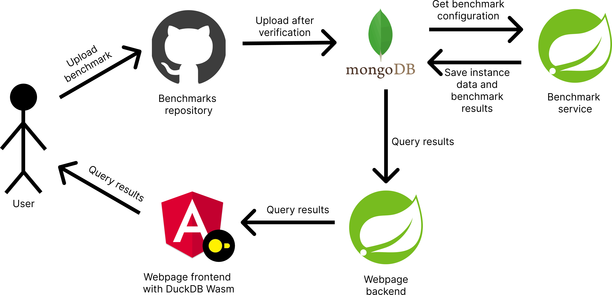

# TUManyBenchmarks - Service for EC2 benchmarking
## About
TUManyBenchmarks is a service that automatically benchmarks EC2 instances.
Its responsibility is to provide users with information about the hardware metrics of different EC2 instances.
The service allows all users to upload benchmarks, which will be executed regularly by TUManyBenchmarks.
After execution, the results are available in the web application, where they are presented on the plot and can be queried.

## Repository structure
The repository consists from 4 main parts:
- `github-pipelines` - GitHub Action pipelines responsible for handling new benchmark uploads
- `benchmark-service` - Spring Boot service responsible for excecuting benchmarks
- `webpage-backend` - Spring Boot service responsible for exposing data about benchmark results
- `webpage-frontend` - Angular application responsible for presenting results to the user
- `example-benchmarks` - example benchmarks with their configuration files that can be executed by the service after moving them to separate repository

## Architecture overview

